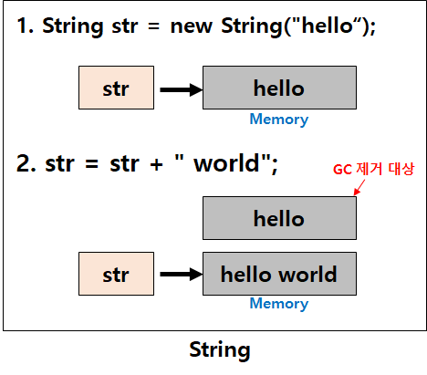
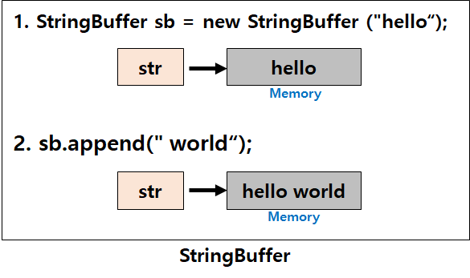
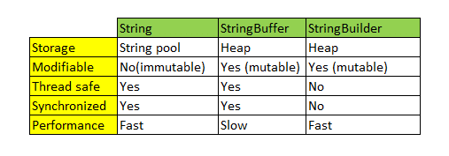

## String, StringBuffer, StringBuilder

문자열을 다루는 대표적인 클래스 세가지가 있습니다.
연산이 많지 않을때에는 어떤 클래스를 사용하더라도 이슈가 발생할 가능성은 거의 없지만,  
연산 횟수가 많아지거나 멀티쓰레드 등의 상황이 자주 발생한다면 각 클래스의 특징을 이해하고 상황에 맞는 적절한 클래스를 사용해야 합니다.

## String은 불변(immutable)의 속성을 갖는다.
```java
String str = "hello"; // String str = new String("hello");
str = str + " world"; // [ hello world ] 
``` 
String 클래스는 불변하기 때문에 문자열을 수정하는 시점에 새로운 String 인스턴스가 생성됩니다.



위와 같이 String은 불변성을 가지기 때문에 변하지 않는 문자열을 자주 읽어들이는 경우 String을 사용해 주시면 좋은 성능을 기대할 수 있습니다.  
그러나 문자열 추가,수정,삭제 등의 연산이 빈번하게 발생하는 알고리즘에 String 클래스를 사용하면 힙 메모리(Heap)에 많은 임시 가비지(Garbage)가 생성되어 힙메모리가 부족으로 어플리케이션 성능에 치명적인 영향을 끼치게 될 수 있습니다.  

이를 해결하기 위해 Java에서는 가변(mutable)성을 가지는 StringBuffer / StringBuilder 클래스를 도입했습니다.  
**String 과는 반대로 StringBuffer/StringBuilder 는 가변성 가지기 때문에 .append() .delete() 등의 API를 이용하여 동일 객체내에서 문자열을 변경하는 것이 가능합니다.  
따라서 문자열의 추가,수정,삭제가 빈번하게 발생할 경우라면 String 클래스가 아닌 *StringBuffer/StringBuilder*를 사용해야 합니다.**

```java
StringBuffer sb = new StringBuffer("hello"); 
sb.append(" world");
```


## StringBuffer vs StringBuilder
그렇다면 동일한 API를 가지고 있는 StringBuffer, StringBuilder의 차이점은 무엇일까요?  
가장 큰 차이점은 동기화의 유무로써 StringBuffer는 동기화 키워드를 지원하여 멀티쓰레드 환경에서 안전하다는 점(thread-safe)입니다.  
참고로 String도 불변성을 가지기때문에 마찬가지로  멀티쓰레드 환경에서의 안정성(thread-safe)을 가지고 있습니다.   
  
반대로 StringBuilder는 동기화를 지원하지 않기때문에 멀티쓰레드 환경에서 사용하는 것은 적합하지 않지만 동기화를 고려하지 않는 만큼 단일쓰레드에서의 성능은 StringBuffer 보다 뛰어납니다.

## 정리
**String**          :  문자열 연산이 적고 멀티쓰레드 환경일 경우  
**StringBuffer**    :  문자열 연산이 많고 멀티쓰레드 환경일 경우  
**StringBuilder**   :  문자열 연산이 많고 단일쓰레드이거나 동기화를 고려하지 않아도 되는 경우    

