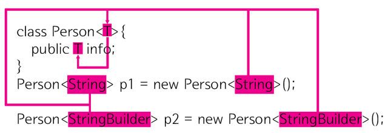

## 제네릭이란?
제네릭은 클래스 내부에서 사용할 데이터 타입을 외부에서 지정하는 기법을 의미합니다.


```java
class Person<T>{
    public T info;
}
 
public class GenericDemo {
 
    public static void main(String[] args) {
        Person<String> p1 = new Person<String>();
        Person<StringBuilder> p2 = new Person<StringBuilder>();
    }
} 
```
즉 클래스를 정의 할 때는 info의 데이터 타입을 확정하지 않고 인스턴스를 생성할 때 데이터 타입을 지정하는 기능이 제네릭이다. 

## 제네릭 사용 이유


